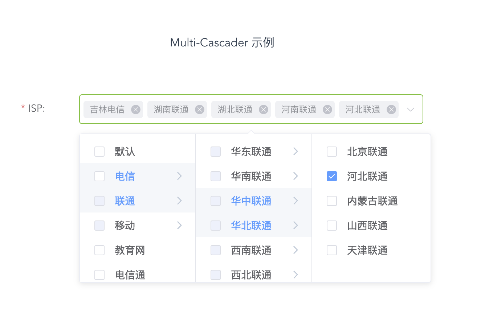
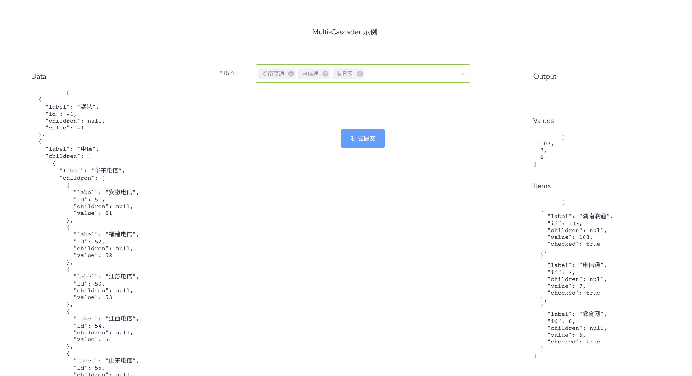

# Multi-Cascader

### 概述

> 由于`elementUI` 的级联选择器暂不支持多选，因此基于`elementUI`开发此组件，所有的样式`class`都是使用 `elementUI` 原样式，基本可无副作用的引入项目使用，有任何问题欢迎发布 `issue`，我会在看到第一时间回复大家。
> 如果觉得组件还不错的话 不要吝啬你的 `star` 哦~
- [查看demo](https://webcoderj.github.io/ele-multi-cascader-demo/)
- [查看demo仓库](https://www.github.com/webcoderj/ele-multi-cascader-demo/)

#### 2019-03-27 更新
- 新增 `clearable` 选项，控制清除全部已选项，同 `elementUI` [#30](https://github.com/webCoderJ/ele-multi-cascader/issues/30)
- 新增 `popperClass` 选项，自定义弹出层 `class`，同 `elementUI` [#30](https://github.com/webCoderJ/ele-multi-cascader/issues/30)
- 新增 `remove-tag`  `clear`事件，同 `elementUI`

#### 2019-03-22 更新
- 支持动态加载子项 [#17](https://github.com/webCoderJ/ele-multi-cascader/issues/17) `Function(parentItem<Object>): Promise: []` 详情查看`Attributes`文档
- 支持通过设置 `label-key` ， `children-key` ， `value-key` 来设置 label、value、children 字段

#### 2019-01-16 更新
- 修复 [#11](https://github.com/webCoderJ/ele-multi-cascader/issues/11) BUG
- 新增 `collapse-tags` 选项，控制输入框标签折叠，同 `elementUI`
- 新增 `show-all-levels` 选项，控制是否展示所有层级，同 `elementUI`
- 新增 `output-level-value` 选项，控制输出value 是否为全部层级
- 新增 `separator` 选项，控制层级分隔符`Note：会对输出value和展示标签同时起作用`
- 新增 `no-data-text` 选项，修改无数据文字

#### 2019-01-14 更新
- 支持选中子项 `selectChildren` [#4](https://github.com/webCoderJ/ele-multi-cascader/issues/4)
- 支持 `@clickItem` 事件，返回当前点击项，触发时机先于 `@change`
- 修复 `v-model` 只能初始化一次的BUG [#5](https://github.com/webCoderJ/ele-multi-cascader/issues/5)

### 安装

> 可直接复制源码

推荐使用npm安装：

```shell
npm install ele-multi-cascader
```

###  使用

```js
// main.js
import EleMultiCascader from "ele-multi-cascader"

Vue.use(Element)
Vue.use(EleMultiCascader)
```

### Attributes

| 参数                                            | 说明                               | 类型                                      | 可选值            | 默认值 |
| ----------------------------------------------- | ---------------------------------- | ----------------------------------------- | ----------------- | ------ |
| options                                         | 选项数据源                         | Array                                     | --                | --     |
| v-model(value)                                  | 绑定值                             | Array                                     | --                | --     |
| placeholder                                     | 占位文本                           | String                                    | --                | 请选择 |
| no-data-text                                    | 无数据占位字符                     | String                                    |                   | 无数据 |
| size                                            | 尺寸                               | String                                    | medium/small/mini | --     |
| disabled                                        | 禁用                               | Boolean                                   | true/false        | false  |
| selectChildren                                  | 点击选中子项                       | Boolean                                   | true/false        | false  |
| collapse-tags                                   | 是否折叠标签                       | Boolean                                   | true/false        | false  |
| show-all-levels                                 | 控制标签展示全部层级               | Boolean                                   | true/false        | false  |
| output-level-value                              | 控制输出value 是否为全部层级       | Boolean                                   | true/false        | false  |
| separator （会对输出value和展示标签同时起作用） | 层级分隔符                         | String                                    | -                 | /      |
| allowLoadChildren                               | 是否动态加载子选项                 | Boolean                                   | true/false        | false  |
| loadChildrenMethod                              | 加载子选项方法                     | Function(parentItem<Object>): Promise: [] | Function          | null   |
| showLoadingIndicator                            | 是否展示子项可加载指示器           | Boolean                                   | true/false        | true   |
| label-key、value-key、children-key              | 用于设置label、value、children字段 | String                                    | String            | label  |
| clearable                                       | 是否可清除全部已选项               | Boolean                                   | true/false        | false  |
| popperClass                                     | Select 下拉框的类名                | string                                    | -                 | -      |


#### Item Attributes

| 参数     | 说明           | 类型                                                         | 可选值     | 默认值 |
| -------- | ------------------------------ | ------------------------------ | ---------- | ------ |
| isLeaf   | 是否为叶子节点 | Boolean，`特别说明：`标记该项目是否为叶子节点(树的最后一层)，仅用于动态加载子项。如果children(childrenKey)值不为空，会直接忽略isLeaf。如果为真，则不会加载子选项，也不会有`加载指示灯`，详情可查看[demo](https://webcoderj.github.io/ele-multi-cascader-demo/) | true/false | false  |
| disabled | 禁用该选项     | Boolean                                                      | true/false | false  |


### 事件

| 事件名称   | 说明                                     | 回调参数                                              |
| ---------- | ---------------------------------------- | ----------------------------------------------------- |
| change     | 绑定值发生变化时                         | (Array:values当前选中值, Array:items当前选中对象数组) |
| blur       | 失去焦点                                 | --                                                    |
| focus      | 获得焦点                                 | --                                                    |
| clickItem  | 点击某个子项                             | Object: 子项                                          |
| spread     | 展开某选项                               | Object: 子项                                          |
| remove-tag | 移除tag时触发                            | (String:label移除的tag，Object:deletedItem所移除选项) |
| clear      | 可清空的单选模式下用户点击清空按钮时触发 | --                                                    |

### 示例




```html
<!-- *.vue -->
<template>
	<el-form label-width="80px" ref="form" :model="form" :rules="rules" label-position="left">
        <el-form-item label="ISP: " prop="isp">
            <ele-multi-cascader
              :options="options"
              v-model="form.isp"
              placeholder="选择运营商"
              @change="ispChange"
              >
            </ele-multi-cascader>
        </el-form-item>
        <el-form-item>
            <el-button type="primary" @click="submit">测试提交</el-button>
        </el-form-item>
    </el-form>
</template>

<script>

export default {
  data() {
    return {
      options: [],
      outputs: {
        values: [],
        items: []
      },
      rules: {
        isp: [
          {
            required: true,
            trigger: "change",
            validator(rule, val, cb) {
              if (val.length === 0) {
                cb(new Error("请选择运营商"));
              } else {
                cb();
              }
            }
          }
        ]
      },
      form: {
        isp: []
      }
    };
  },
  methods: {
    ispChange(values, items) {
      this.outputs.values = values;
      this.outputs.items = items;
    },
    submit() {
      this.$refs.form.validate(valid => {
        if (valid) {
          this.$message({
            message: "测试通过",
            type: "success"
          });
        }
      });
    }
  }
};
</script>
```

### 依赖

```
- Vue
- ElementUI
```
